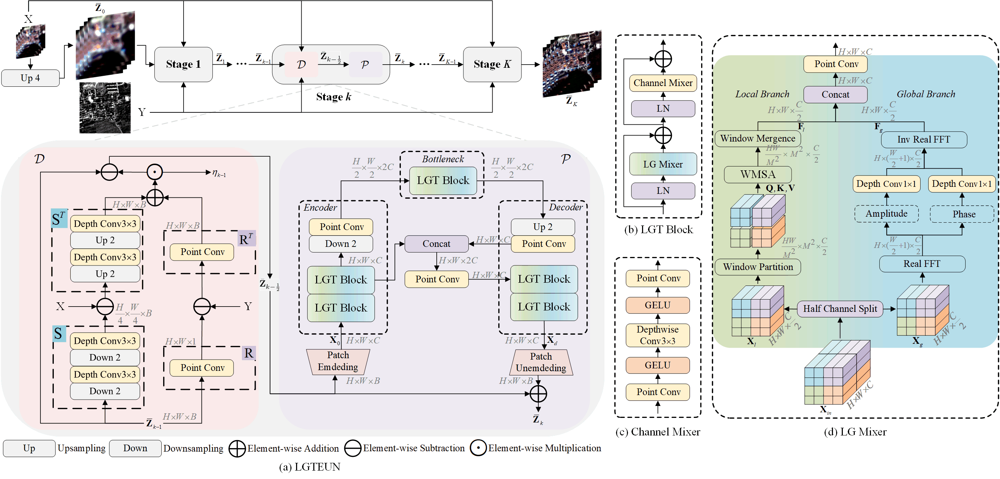

# Local-Global Transformer Enhanced Unfolding Network for Pan-sharpening

[Mingsong Li](https://lms-07.github.io/), Yikun Liu, Tao
Xiao, [Yuwen Huang](https://jsj.hezeu.edu.cn/info/1302/6525.htm), and [Gongping Yang](https://faculty.sdu.edu.cn/gpyang)

[Time Lab](https://time.sdu.edu.cn/), [SDU](https://www.sdu.edu.cn/)

-----------
This repository is the official implementation of our paper:
[Local-Global Transformer Enhanced Unfolding Network for Pan-sharpening](https://arxiv.org/abs/2304.14612),
International Joint Conference on Artificial Intelligence (IJCAI) 2023 (15% acceptance).

## Contents

1. [Brief Introduction](#Brief-Introduction)
1. [Environment](#Environment)
1. [Datasets and File Hierarchy](#Datasets-and-File-Hierarchy)
1. [Implementations of Compared Methods](#Implementations-of-Compared-Methods)
1. [Notes](#Notes)
1. [Citation](#Citation)
1. [License and Acknowledgement](License-and-Acknowledgement)

## Brief Introduction

> <p align="left"><i>Pan-sharpening</i> aims to increase the spatial resolution of the low-resolution multispectral (LrMS) image with the guidance of the corresponding panchromatic (PAN) image. Although deep learning (DL)-based pan-sharpening methods have achieved promising performance, most of them have a two-fold deficiency. For one thing, the universally adopted black box principle limits the model interpretability. For another thing, existing DL-based methods fail to efficiently capture local and global dependencies at the same time, inevitably limiting the overall performance. To address these mentioned issues, we first formulate the degradation process of the high-resolution multispectral (HrMS) image as a unified variational optimization problem, and alternately solve its data and prior subproblems by the designed iterative proximal gradient descent (PGD) algorithm. Moreover, we customize a Local-Global Transformer (LGT) to simultaneously model local and global dependencies, and further formulate an LGT-based prior module for image denoising. Besides the prior module, we also design a lightweight data module. Finally, by serially integrating the data and prior modules in each iterative stage, we unfold the iterative algorithm into a stage-wise unfolding network, <b>L</b>ocal-<b>G</b>lobal <b>T</b>ransformer <b>E</b>nhanced <b>U</b>nfolding <b>N</b>etwork (LGTEUN), for the interpretable MS pan-sharpening. Comprehensive experimental results on three satellite data sets demonstrate the effectiveness and efficiency of LGTEUN compared with state-of-the-art (SOTA) methods. The source code is available at https://github.com/lms-07/LGTEUN.</p>


**LGTEUN Framework**



## Environment

- The software environment is Ubuntu 18.04.5 LTS 64 bit.
- This project is running on a single Nvidia GeForce RTX 3090 GPU based on Cuda 11.0.
- We adopt Python 3.6.13, PyTorch 1.9.1+cu111.
- Personally speaking, the py+torch combination with **mmcv** library needs to be chosen carefully, maybe encountering version
  mismatching problems.
- Some key commands of my version referring [the codebase of PanFormer](https://github.com/zhysora/PanFormer), as follows:
```text
pip install mmcv==1.2.7
conda install gdal=3.1.0 -c conda-forge
conda install scikit-image=0.17.2
pip install scipy==1.5.4
pip install gpustat==1.0.0
pip install numba==0.53.1 
pip install einops==0.4.1 
pip install timm==0.6.11
pip install sewar==0.4.5
```

## Datasets and File Hierarchy
- For multispectral pan-sharpening, there are no standard widely-used public data sets instead of private data sets
  constructed by respective research groups. **To promote the development of this task, we also share our
  constructed data sets here through
  [Google Drive](https://drive.google.com/file/d/1SoChKZ3zk1WeMKoSOvKo3AQBiOXPw0Wd/view?usp=drive_link).**
- Three representative multispectral scenes acquired by three popular multispectral sensors (GaoFen-2, WorldView-2, and
  WorldView-3) are utilized to construct our three data sets, directly named GF-2, WV-2, and WV-3 for convenience.
    - The constructing codes are based on [tools of PanFormer](https://github.com/zhysora/PanFormer/tree/main/tools). **Cool implementation!**
    - For each raw data, the training and testing parts are from the same scene, and cropped to completely separate with no overlapping parts.
    - We follow Wald's protocol to construct image pairs.
    - We set various step sizes for each data set to generate about 1000 LrMS/PAN/GT image pairs for training and 140
      LrMS/PAN/GT image pairs for testing on reduced-resolution scenes. For full-resolution scenes, we just reserve 120
      LrMS/PAN image pairs on all the three data sets. Details are as follow:
      
    | Data Set | Step Size | Reduced-resolution Image Pairs for Training | Reduced-resolution Image Pairs for Testing | Full-resolution Image Pairs for Testing |
    | :---: | :---: | :---: | :---: | :---: |
    | GF-2 | 52 | 1036 | 136 | 120 |
    | WF-2 | 18 | 1012 | 145 | 120 |
    | WV-3 | 8 | 910 | 144 | 120 |

Our project is organized as follows:

```text
LGTEUN
|-- configs             // config files for each involved method
|-- data                // files for storing output pan-sharpening img
|-- dataset             // data set build related files                    
|-- log_results         // running logs for each method adopted in our paper
|-- models
|   |-- base            // basic model framework related files
|   |-- common          // operations and modules used in compared methods
|-- src                 // source files
|-- Dataset             // files for storing data sets
|   |--GF2
|   |   |--train_reduce_res
|   |   |--test_reduce_res
|   |   |--test_full_res
|   |--WV2
|   |   |--train_reduce_res
|   |   |--test_reduce_res
|   |   |--test_full_res
|   |--WV3
|   |   |--train_reduce_res
|   |   |--test_reduce_res
|   |   |--test_full_res
|-- weight_results      // files for storing deep learning based models' checkpoints
```

## Implementations of Compared Methods

For comparisons, our codebase also includes all the related compared methods in our paper, i.e., three classic model
based methods and six most advanced deep learning based methods.

| Method | Title | Published | Codebase | 
| :---: | :---: | :---: | :---: | 
| GSA | [Improving Component Substitution Pansharpening Through Multivariate Regression of MS + Pan Data](https://ieeexplore.ieee.org/document/4305344) | TGRS 2007 | [code]() |
| SFIM | [Smoothing Filter-based Intensity Modulation: A spectral preserve image fusion technique for improving spatial details](https://www.tandfonline.com/doi/abs/10.1080/014311600750037499) | IJRS 2000 | [code]() |
| Wavelet | [A wavelet based algorithm for pan sharpening Landsat 7 imagery](https://doi.org/10.1109/IGARSS.2001.976657) | IGARSS 2001 | [code]() | 
| PanFormer | [PanFormer: A Transformer Based Model for Pan-Sharpening](https://ieeexplore.ieee.org/document/9859770) | ICME 2022 | [code](https://github.com/zhysora/PanFormer/blob/main/models/panformer.py) |
| CTINN | [Pan-Sharpening with Customized Transformer and Invertible Neural Network](https://ojs.aaai.org/index.php/AAAI/article/view/20267) | AAAI 2022 | [code](https://github.com/KevinJ-Huang/PAN_Sharp_INN_Transformer/blob/main/models/GPPNN.py) | 
| LightNet | [SpanConv: A New Convolution via Spanning Kernel Space for Lightweight Pansharpening](https://www.ijcai.org/proceedings/2022/118) | IJCAI 2022 | [code](https://github.com/zhi-xuan-chen/IJCAI-2022_SpanConv/blob/main/codes/model_wv3.py) | 
| SFIIN | [Spatial-Frequency Domain Information Integration for Pan-Sharpening](https://link.springer.com/chapter/10.1007/978-3-031-19797-0_16) | ECCV 2022 | [code](https://github.com/manman1995/Awaresome-pansharpening/blob/main/model/SFITNET-ECCV.py) |
| MutInf | [Mutual Information-Driven Pan-Sharpening](https://openaccess.thecvf.com/content/CVPR2022/html/Zhou_Mutual_Information-Driven_Pan-Sharpening_CVPR_2022_paper.html) | CVPR 2022 | [code](https://github.com/manman1995/Mutual-Information-driven-Pan-sharpening/blob/main/models/GPPNN.py) | 
| MDCUN | [Memory-Augmented Deep Conditional Unfolding Network for Pan-Sharpening](https://openaccess.thecvf.com/content/CVPR2022/html/Yang_Memory-Augmented_Deep_Conditional_Unfolding_Network_for_Pan-Sharpening_CVPR_2022_paper.html) | CVPR 2022 | [code](https://github.com/yggame/MDCUN/blob/main/model/pan_unfolding_v4.py) | 

## Notes

- We provide all the corresponding [log files] and most [checkpoint wights] for each method to quickly check our
  published results, and some invalid weights are not provided due to model code changes without rollbacks.
- Our model **LGTEUN** also has a primary-version name, i.e., **UnlgFormer** in our codebase owing to keeping model codes
  unchanged to ensure the effectiveness of checkpoint weights. So does **CTINN** with **INNT**.

## Citation

Please kindly cite our work if this work is helpful for your research.

[1] M. Li, Y. Liu, T. Xiao, Y. Huang and G. Yang, "Local-Global Transformer Enhanced Unfolding Network for
Pan-sharpening," arXiv preprint arXiv:2304.14612, 2023.

BibTex entry:

```text
@article{li2023local,
  title={Local-Global Transformer Enhanced Unfolding Network for Pan-sharpening},
  author={Li, Mingsong and Liu, Yikun and Xiao, Tao and Huang, Yuwen and Yang, Gongping},
  journal={arXiv preprint arXiv:2304.14612},
  year={2023}
}
```

## Contact information

If you have any problem, please do not hesitate to contact us `msli@mail.sdu.edu.cn`.

## License and Acknowledgement

- This project is released under [GPLv3](http://www.gnu.org/licenses/) license.
- Our task operating framework is implemented based on [PanFormer](https://github.com/zhysora/PanFormer).
- Our proposed LGTEUN framework is inspired by many awesome works, and some of them are as follows:
    - [Degradation-Aware Unfolding Half-Shuffle Transformer for Spectral Compressive Imaging](https://proceedings.neurips.cc/paper_files/paper/2022/hash/f621c2ead473ca36763696b712ffda01-Abstract-Conference.html)
      , NeurIPS 2022
    - [Spatial-Frequency Domain Information Integration for Pan-Sharpening](https://link.springer.com/chapter/10.1007/978-3-031-19797-0_16)
      , ECCV 2022
    - [Inception Transformer](https://proceedings.neurips.cc/paper_files/paper/2022/hash/94e85561a342de88b559b72c9b29f638-Abstract-Conference.html)
      , NeurIPS 2022

  


